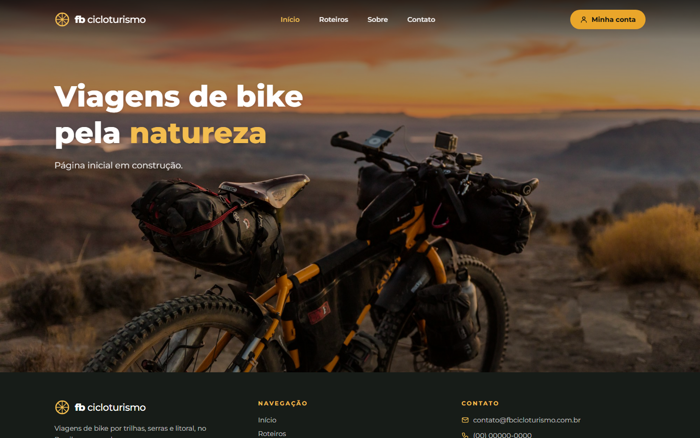
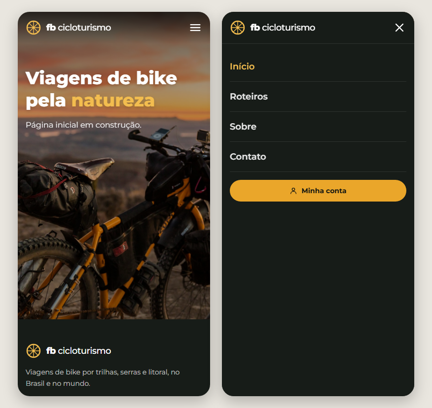
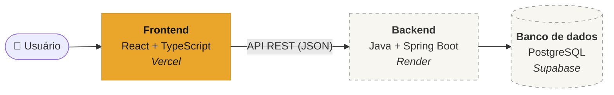
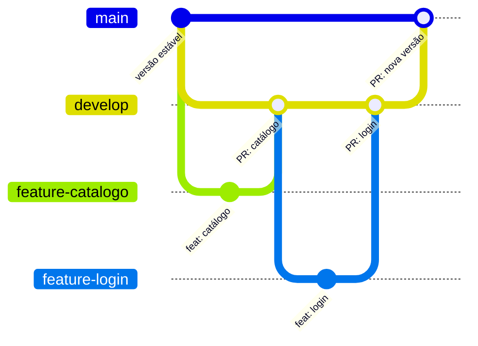

<div align="center">


# Fabinho Cicloturismo

**Viagens de bike pela natureza: trilhas, serras e litoral, no Brasil e no mundo.**


[Sobre](#-sobre-o-projeto) •
[Demonstração](#-demonstração) •
[Funcionalidades](#-funcionalidades) •
[Arquitetura](#-arquitetura) •
[Como executar](#-como-executar) •
[Roadmap](#-roadmap)

<br />



</div>

---

## 🚴 Sobre o projeto

O **Fabinho Cicloturismo** é uma plataforma de cicloturismo e viagens de bicicleta que conecta ciclistas e entusiastas de aventura a roteiros inesquecíveis. A ideia é unir o planejamento da viagem, a escolha do nível de pedal (do recreativo ao avançado) e a descoberta de destinos cênicos, com foco em conforto, superação e segurança.

É um projeto de portfólio **full stack**, construído como um produto real:

- **Frontend** em React + TypeScript, responsivo e organizado para crescer.
- **Backend** em Java + Spring Boot, com uma API REST (próxima etapa).
- **Área do cliente** com login, para quem quer comprar e acompanhar seus passeios.

---

## 📸 Demonstração

<table>
  <tr>
    <th>Desktop</th>
    <th>Celular (página inicial e menu)</th>
  </tr>
  <tr>
    <td></td>
    <td></td>
  </tr>
</table>

> O cabeçalho fica **transparente sobre a foto** e ganha fundo sólido quando o usuário rola a página. No celular, o menu abre em tela cheia.

---

## ✨ Funcionalidades

### Já disponível

- [x] Layout **responsivo** (mobile first): celular, tablet e desktop
- [x] Cabeçalho com menu desktop e **menu mobile** (fecha com Esc e trava a rolagem da página)
- [x] Rodapé com navegação e contato
- [x] Botão **Minha conta**, que leva à futura área do cliente
- [x] Rotas com **carregamento sob demanda** (lazy loading) e página 404

### Em construção

- [ ] **Catálogo de roteiros por destino:** opções nacionais e internacionais estruturadas por ciclistas
- [ ] **Filtros por estilo e nível:** passeios como *Discovery*, *Collection* ou *Epic Rides*, de acordo com a intensidade e a quilometragem diária
- [ ] **Detalhes técnicos de cada viagem:** altimetria, tipo de terreno, hospedagem e suporte logístico
- [ ] **Login e área do cliente:** cadastro, compra de passeios e acompanhamento das reservas

---

## 🏗️ Arquitetura

O repositório é um **monorepo**: frontend e backend ficam no mesmo projeto, em pastas separadas, e cada um é publicado de forma independente.



<sub>Em laranja: o que já existe. Tracejado: o que vem nas próximas etapas.</sub>

### Stack

| Camada | Tecnologias | Status |
| --- | --- | --- |
| **Frontend** | React 19, TypeScript, Vite, Tailwind CSS 4, React Router 7 | ✅ Em andamento |
| **Backend** | Java, Spring Boot, Spring Web, Spring Data JPA, Bean Validation | 🔜 Próxima etapa |
| **Banco de dados** | PostgreSQL | 🔜 Próxima etapa |
| **Qualidade** | oxlint (regras de React e TypeScript) e checagem de tipos no build | ✅ |
| **Deploy** | Vercel (frontend), Render (API), Supabase (banco) | 🔜 Planejado |

<details>
<summary><b>🧠 Decisões técnicas do frontend</b> (clique para expandir)</summary>

<br />

| Decisão | Por quê |
| --- | --- |
| **Uma pasta por página** (`pages/Inicio`, `pages/MinhaConta`...) | Cada página reúne seus próprios componentes. Quando um componente passa a ser usado em mais de um lugar, ele sobe para `components/`. |
| **Configuração centralizada** (`config/`, `constants/`) | Menu, dados de contato e caminhos das rotas ficam num lugar só. Mudar um telefone ou adicionar um item no menu é editar uma linha. |
| **Lazy loading das páginas** | Cada página é baixada só quando o usuário entra nela, o que deixa o carregamento inicial mais leve. |
| **Imports absolutos com `@/`** | `@/components/ui/Logo` em vez de `../../../components/ui/Logo`: mais legível e resistente a mudanças de pasta. |
| **Hooks reutilizáveis** (`useRolagemPassou`, `useTravarRolagem`) | A lógica de comportamento fica separada da interface e pode ser reaproveitada. |
| **Tema no Tailwind** (`@theme`) | Cores e fontes definidas como tokens (`night-*`, `amber-*`). Trocar a identidade visual é mudar um arquivo. |
| **Nomes em português** | O domínio do negócio é brasileiro. `Cabecalho`, `MinhaConta` e `linksNavegacao` deixam o código próximo da linguagem do produto. |
| **Acessibilidade** | `aria-label`, `aria-expanded`, navegação por teclado (Esc) e textos para leitores de tela. |

</details>

---

## 📁 Estrutura do repositório

```
fb-cicloturismo/
├── frontend/                  # Aplicação React (Vite + TypeScript)
│   ├── public/images/         # Imagens estáticas
│   └── src/
│       ├── app/               # App e mapa de rotas
│       ├── components/
│       │   ├── icones/        # Ícones SVG
│       │   ├── layout/        # LayoutPrincipal, Cabecalho, Rodape
│       │   └── ui/            # Componentes genéricos (Logo, Container...)
│       ├── config/            # Dados editáveis (menu, contato da empresa)
│       ├── constants/         # Caminhos das rotas
│       ├── hooks/             # Hooks reutilizáveis
│       ├── pages/             # Uma pasta por página
│       ├── services/          # Comunicação com a API
│       ├── styles/            # Tailwind + tema
│       └── types/             # Tipos compartilhados
├── backend/                   # API Spring Boot (em breve)
└── docs/                      # Imagens do README
```

Mais detalhes no [README do frontend](frontend/README.md).

---

## 🚀 Como executar

**Pré-requisitos:** [Node.js](https://nodejs.org/) 20 ou superior.

```bash
# 1. Clone o repositório
git clone https://github.com/fabio-furlan/fb-cicloturismo.git
cd fb-cicloturismo/frontend

# 2. Instale as dependências
npm install

# 3. Rode em modo de desenvolvimento
npm run dev
```

Acesse **http://localhost:5173**.

<details>
<summary><b>Outros comandos</b></summary>

<br />

| Comando | O que faz |
| --- | --- |
| `npm run build` | Checa os tipos e gera o build de produção em `dist/` |
| `npm run preview` | Serve o build de produção localmente |
| `npm run lint` | Analisa o código com o oxlint |

</details>

---

## 🌿 Fluxo de trabalho (Git)

O projeto segue um fluxo com branches de feature, integração na `develop` e versões estáveis na `main`. Toda alteração entra por **Pull Request**.



<sub>Exemplo de como uma funcionalidade percorre as branches até chegar à `main`.</sub>

| Branch | Papel |
| --- | --- |
| `main` | Versão estável. Só recebe código vindo da `develop`. |
| `develop` | Integração das funcionalidades prontas para teste. |
| `feature-*` | Uma alteração específica, criada a partir da `develop`. |

**Padrão de commits:** `feat:` nova funcionalidade · `fix:` correção · `docs:` documentação · `refactor:` reorganização sem mudar comportamento.

---

## 🗺️ Roadmap

- [x] **Fase 1: Fundação do frontend.** Estrutura, layout responsivo, cabeçalho, rodapé e rotas.
- [ ] **Fase 2: Catálogo.** Página inicial completa, listagem de roteiros com filtros e página de detalhes da viagem.
- [ ] **Fase 3: Backend.** API REST em Spring Boot com PostgreSQL (roteiros, clientes e reservas).
- [ ] **Fase 4: Área do cliente.** Login, cadastro, compra de passeios e histórico de reservas.
- [ ] **Fase 5: Deploy.** Frontend na Vercel, API no Render e banco no Supabase, com link público para teste.

---

## 📷 Créditos

Foto da página inicial: [Patrick Hendry](https://unsplash.com/photos/1ow9zrlldJU) no Unsplash, sob a [Licença Unsplash](https://unsplash.com/license) (uso gratuito, inclusive comercial).

---

<div align="center">

Feito por **[Fabio Furlan](https://github.com/fabio-furlan)** 🚴

⭐ Se gostou do projeto, deixe uma estrela!

</div>
