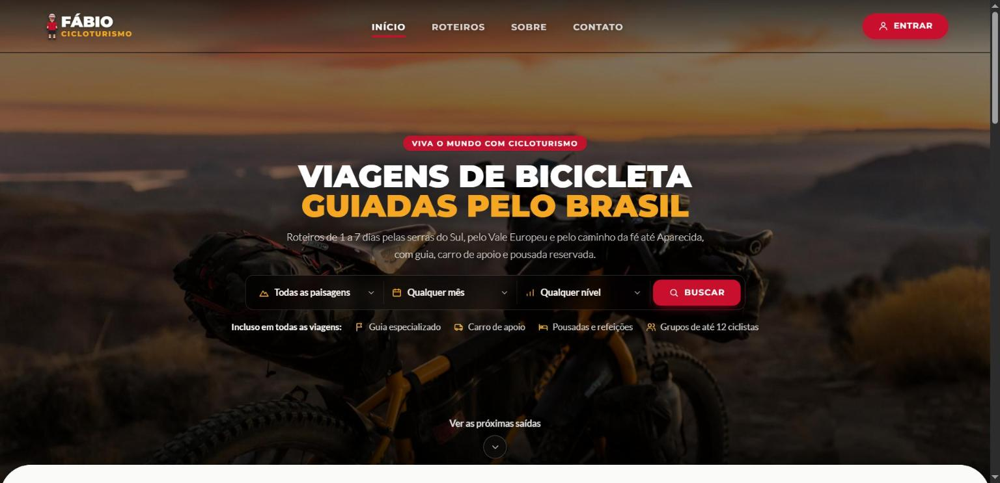
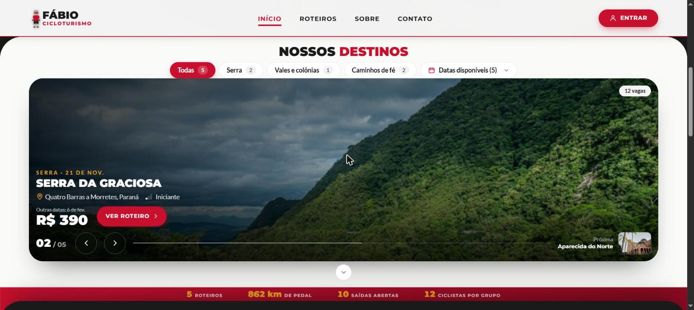
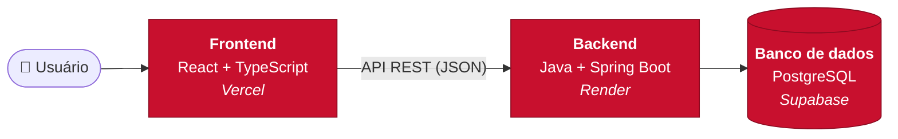
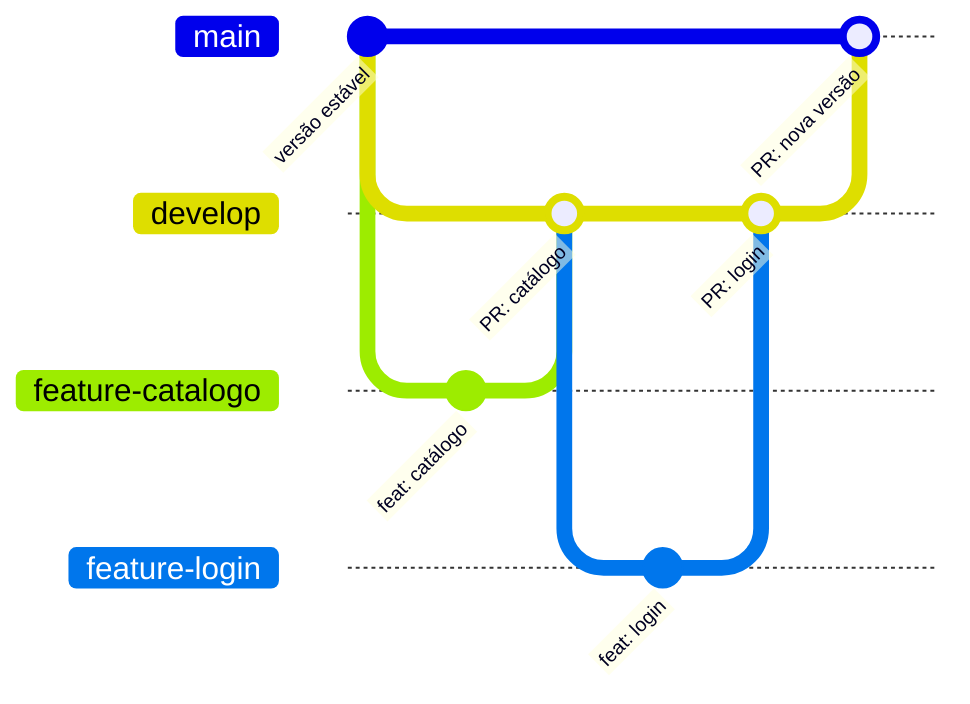

<div align="center">


# Fábio Cicloturismo

**Viagens de bike pela natureza: trilhas, serras e litoral, no Brasil e no mundo.**


### 🌐 [Ver o site no ar](https://fb-cicloturismo.vercel.app)

[Sobre](#-sobre-o-projeto) •
[Demonstração](#-demonstração) •
[Funcionalidades](#-funcionalidades) •
[Arquitetura](#-arquitetura) •
[Como executar](#-como-executar) •
[Roadmap](#-roadmap)

<br />



</div>

---

## 🚴 Sobre o projeto

O **Fábio Cicloturismo** é uma plataforma de cicloturismo e viagens de bicicleta que conecta ciclistas e entusiastas de aventura a roteiros inesquecíveis. A ideia é unir o planejamento da viagem, a escolha do nível de pedal (do iniciante ao avançado) e a descoberta de destinos cênicos, com foco em conforto, superação e segurança.

É um projeto de portfólio **full stack**, construído como um produto real:

- **Frontend** em React + TypeScript, responsivo e organizado para crescer.
- **Backend** em Java 21 + Spring Boot, com uma API REST para o painel do ADM e o catálogo do site.
- **Área do cliente** com login, para quem quer comprar e acompanhar seus passeios.

---

## 📸 Demonstração

**Veja rodando:** [fb-cicloturismo.vercel.app](https://fb-cicloturismo.vercel.app). O site publicado acompanha a branch
`main`, então as novidades da `develop` aparecem lá quando entram numa nova versão.

<table>
  <tr>
    <th>Computador: próximas saídas</th>
    <th>Celular: topo e próximas saídas</th>
  </tr>
  <tr>
    <td></td>
    <td></td>
  </tr>
</table>

> A página inicial é dividida em partes que **sobem umas sobre as outras como camadas**, com cantos arredondados. As
> próximas saídas aparecem numa **vitrine em tela cheia**: a foto troca com um efeito de cortina e o texto sobe linha a
> linha. Tudo é ajustado à altura da tela, do celular ao monitor grande.

---

## ✨ Funcionalidades

### Já disponível

- [x] Layout **responsivo** (mobile first), testado em celulares, tablets, notebooks e monitores grandes
- [x] **Identidade visual** em vermelho, amarelo e verde, com títulos em Montserrat e textos em Lato
- [x] Cabeçalho transparente sobre a foto do topo, que fica branco ao rolar, e **menu mobile** em tela cheia
- [x] Rodapé com navegação e contato, e páginas que sempre abrem no topo
- [x] Rotas com **carregamento sob demanda** (lazy loading) e página 404
- [x] Página inicial com **busca de viagens** por paisagem, mês e nível
- [x] **Vitrine das próximas saídas** em tela cheia, com troca automática, efeito de cortina e filtros por paisagem e mês
- [x] **Faixa de números** do catálogo (roteiros, km de pedal, saídas abertas), com contagem animada
- [x] **Calculadora de nível:** indica quais roteiros cabem no ritmo de quem visita
- [x] **Rolagem animada:** partes da página em camadas, conteúdo que surge ao rolar e parallax na foto do topo
- [x] **Explorador de rota:** perfil altimétrico interativo, inclinação por trecho e simulação do percurso
- [x] **API do ADM:** cadastro de roteiros e saídas, publicação, cancelamento, duplicação para novas datas e opcionais
- [x] **Login do ADM** com JWT e senhas em BCrypt
- [x] **Catálogo público** da API, consumido pela página inicial

### Em construção

- [ ] **Catálogo de roteiros por destino:** opções nacionais e internacionais estruturadas por ciclistas
- [ ] **Filtros por estilo e nível:** passeios como *Discovery*, *Collection* ou *Epic Rides*, de acordo com a intensidade e a quilometragem diária
- [ ] **Detalhes técnicos de cada viagem:** altimetria, tipo de terreno, hospedagem e suporte logístico
- [ ] **Telas do painel do ADM:** dashboard das saídas e formulários sobre a API que já existe
- [ ] **Login e área do cliente:** cadastro, compra de passeios e acompanhamento das reservas

---

## 🏗️ Arquitetura

O repositório é um **monorepo**: frontend e backend ficam no mesmo projeto, em pastas separadas, e cada um é publicado de forma independente.



<sub>As três camadas já existem. A publicação nos serviços indicados está descrita no [guia de deploy](docs/deploy.md).</sub>

### Stack

| Camada | Tecnologias | Status |
| --- | --- | --- |
| **Frontend** | React 19, TypeScript, Vite, Tailwind CSS 4, React Router 7 | ✅ Em andamento |
| **Backend** | Java 21, Spring Boot 4, Spring Web, Spring Data JPA, Spring Security (JWT), Bean Validation, springdoc (OpenAPI) | ✅ Em andamento |
| **Banco de dados** | PostgreSQL 17, migrations com Flyway (Docker no desenvolvimento, Supabase em produção) | ✅ |
| **Qualidade** | Frontend: oxlint e checagem de tipos no build. Backend: JUnit 5, AssertJ e Testcontainers (testes contra um PostgreSQL real) | ✅ |
| **Deploy** | Vercel (frontend), Render (API), Supabase (banco) | ⚙️ Configurado, falta publicar ([guia](docs/deploy.md)) |

<details>
<summary><b>🧠 Decisões técnicas do frontend</b> (clique para expandir)</summary>

<br />

| Decisão | Por quê |
| --- | --- |
| **Uma pasta por página** (`pages/Inicio`, `pages/MinhaConta`...) | Cada página reúne seus próprios componentes. Quando um componente passa a ser usado em mais de um lugar, ele sobe para `components/`. |
| **Configuração centralizada** (`config/`, `constants/`) | Menu, dados de contato e caminhos das rotas ficam num lugar só. Mudar um telefone ou adicionar um item no menu é editar uma linha. |
| **Lazy loading das páginas** | Cada página é baixada só quando o usuário entra nela, o que deixa o carregamento inicial mais leve. |
| **Imports absolutos com `@/`** | `@/components/ui/Logo` em vez de `../../../components/ui/Logo`: mais legível e resistente a mudanças de pasta. |
| **Hooks reutilizáveis** (`useRolagemPassou`, `useTravarRolagem`, `useRevelarAoRolar`, `useRolagemAoTopo`) | A lógica de comportamento fica separada da interface e pode ser reaproveitada. |
| **Tema no Tailwind** (`@theme`) | Cores e fontes definidas como tokens (`vermelho-*`, `sol-*`, `verde-*`, `carvao-*`, `creme-*`). Trocar a identidade visual é mudar um arquivo. |
| **Ajuste à altura da tela** | Além das larguras do Tailwind, há variantes pela altura da janela (`baixa`, `mini`, `curta`), e a vitrine calcula a própria altura para o título, os filtros e a faixa de números caberem juntos na tela, do notebook baixo ao monitor 2K. |
| **Animações com respeito ao usuário** | Entradas, parallax e troca da vitrine usam CSS e animações ligadas à rolagem; quem pede "reduzir movimento" no sistema vê tudo parado. |
| **Nomes em português** | O domínio do negócio é brasileiro. `Cabecalho`, `MinhaConta` e `linksNavegacao` deixam o código próximo da linguagem do produto. |
| **Acessibilidade** | `aria-label`, `aria-expanded`, navegação por teclado (Esc) e textos para leitores de tela. |

</details>

<details>
<summary><b>🧠 Decisões técnicas do backend</b> (clique para expandir)</summary>

<br />

| Decisão | Por quê |
| --- | --- |
| **Pacote por funcionalidade** (`expedicao/`, `autenticacao/`), cada um com `api`, `aplicacao`, `dominio` e `infraestrutura` | O código de um assunto fica junto. As regras de negócio moram no domínio; os controllers só traduzem HTTP. |
| **Roteiro × Saída** | O roteiro é o produto (percurso, fotos, altimetria). A saída é cada edição vendável, com datas, vagas, preço e opcionais próprios. "Duplicar" copia uma saída para novas datas. |
| **Status calculado** | Só a situação editorial (rascunho, publicada, cancelada) é gravada. Aberta, esgotada, em andamento e finalizada saem das datas e das vagas, então nunca ficam desatualizadas. |
| **Concorrência otimista** (`@Version`) | Duas alterações simultâneas na mesma saída não se sobrescrevem: a segunda recebe 409 e recarrega. É o que vai impedir duas reservas ao mesmo tempo de passar da capacidade. |
| **Erros em Problem Details** (RFC 9457) | Validação responde 400, regra de negócio 422, recurso inexistente 404, sempre no mesmo formato JSON. |
| **JWT stateless** | Sem sessão nem cookie, o site na Vercel conversa com a API no Render sem configuração de cookies entre domínios. O mesmo 401 para e-mail inexistente e senha errada não revela quem tem conta. |
| **Flyway** | O esquema do banco é versionado em SQL junto com o código; o Hibernate só valida que o mapeamento confere. |
| **Testcontainers** | Os testes de persistência e de API sobem um PostgreSQL de verdade, o mesmo do deploy, em vez de um banco em memória com outro dialeto. |
| **Relógio injetável** (`Clock`) | "Hoje" decide o status das saídas; nos testes, a data é fixa e o resultado não muda com o calendário. |

</details>

---

## 📁 Estrutura do repositório

```
fb-cicloturismo/
├── frontend/                  # Aplicação React (Vite + TypeScript)
│   ├── public/images/         # Imagens estáticas
│   └── src/
│       ├── app/               # App e mapa de rotas
│       ├── components/
│       │   ├── icones/        # Ícones SVG
│       │   ├── layout/        # LayoutPrincipal, Cabecalho, Rodape
│       │   └── ui/            # Componentes genéricos (Logo, Container...)
│       ├── config/            # Dados editáveis (menu, contato da empresa)
│       ├── constants/         # Caminhos das rotas
│       ├── hooks/             # Hooks reutilizáveis
│       ├── pages/             # Uma pasta por página
│       ├── services/          # Comunicação com a API
│       ├── styles/            # Tailwind + tema
│       └── types/             # Tipos compartilhados
├── backend/                   # API Spring Boot (Java 21 + Maven)
│   └── src/main/java/br/com/fbcicloturismo/
│       ├── expedicao/         # Roteiros, saídas, opcionais e catálogo público
│       ├── autenticacao/      # Login do ADM e administradores
│       └── compartilhado/     # Segurança, erros e configurações comuns
├── docs/                      # Guia de deploy e imagens do README
└── render.yaml                # Configuração do deploy da API no Render
```

Mais detalhes no [README do frontend](frontend/README.md) e no [guia de deploy](docs/deploy.md).

---

## 🚀 Como executar

**Pré-requisitos:** [Node.js](https://nodejs.org/) 20 ou superior.

```bash
# 1. Clone o repositório
git clone https://github.com/fabio-furlan/fb-cicloturismo.git
cd fb-cicloturismo/frontend

# 2. Instale as dependências
npm install

# 3. Rode em modo de desenvolvimento
npm run dev
```

Acesse **http://localhost:5173**. Sem configuração, o site usa dados de exemplo. Para usá-lo com a API, veja
[Conectando à API](frontend/README.md#conectando-à-api).

<details>
<summary><b>Outros comandos</b></summary>

<br />

| Comando | O que faz |
| --- | --- |
| `npm run build` | Checa os tipos e gera o build de produção em `dist/` |
| `npm run preview` | Serve o build de produção localmente |
| `npm run lint` | Analisa o código com o oxlint |

</details>

### Backend

**Pré-requisitos:** JDK 21 (versões anteriores não rodam o projeto) e
[Docker Desktop](https://www.docker.com/products/docker-desktop/) aberto.

```bash
cd fb-cicloturismo/backend

# Sobe a API em http://localhost:8080. O PostgreSQL do compose.yaml sobe sozinho,
# e as variáveis criam o primeiro administrador (senha com 12 caracteres ou mais).
APP_ADMIN_EMAIL=voce@exemplo.com APP_ADMIN_SENHA=uma-senha-longa ./mvnw spring-boot:run

# Testes (o Testcontainers usa o Docker)
./mvnw test
```

<details>
<summary><b>Windows, outro JDK instalado ou porta 8080 ocupada</b></summary>

<br />

Se o `JAVA_HOME` aponta para outra versão do Java, indique o JDK 21 só para este comando. Se a porta 8080 já estiver
em uso (o Oracle, por exemplo, ocupa essa porta), suba a API em outra, como a 8081:

```powershell
cd fb-cicloturismo\backend
$env:JAVA_HOME="C:\caminho\para\jdk-21"; $env:PORT="8081"; .\mvnw.cmd spring-boot:run
```

Nesse caso, aponte o frontend para a mesma porta em `frontend/.env.local`: `VITE_API_URL=http://localhost:8081`.

</details>

A documentação interativa da API (Swagger) fica em **http://localhost:8080/docs**. Para chamar as rotas do ADM, faça o
login em `POST /api/auth/login` e cole o token em **Authorize**.

---

## 🌿 Fluxo de trabalho (Git)

O projeto segue um fluxo com branches de feature, integração na `develop` e versões estáveis na `main`. Toda alteração entra por **Pull Request**.



<sub>Exemplo de como uma funcionalidade percorre as branches até chegar à `main`.</sub>

| Branch | Papel |
| --- | --- |
| `main` | Versão estável. Só recebe código vindo da `develop`. |
| `develop` | Integração das funcionalidades prontas para teste. |
| `feature-*` | Uma alteração específica, criada a partir da `develop`. |

**Padrão de commits:** `feat:` nova funcionalidade · `fix:` correção · `docs:` documentação · `refactor:` reorganização sem mudar comportamento.

---

## 🗺️ Roadmap

- [x] **Fase 1: Fundação do frontend.** Estrutura, layout responsivo, cabeçalho, rodapé e rotas.
- [ ] **Fase 2: Catálogo.** Página inicial completa, listagem de roteiros com filtros e página de detalhes da viagem. *Em andamento: a página inicial está pronta, com o novo visual, e já lê a API.*
- [ ] **Fase 3: Backend.** API REST em Spring Boot com PostgreSQL (roteiros, clientes e reservas). *Em andamento: roteiros, saídas e login do ADM prontos; faltam clientes e reservas.*
- [ ] **Fase 4: Área do cliente.** Login, cadastro, compra de passeios e histórico de reservas.
- [ ] **Fase 5: Deploy.** Frontend na Vercel, API no Render e banco no Supabase, com link público para teste. *Em andamento: o site já está no ar em [fb-cicloturismo.vercel.app](https://fb-cicloturismo.vercel.app).*

---

## 📷 Créditos

Foto da página inicial: [Patrick Hendry](https://unsplash.com/photos/1ow9zrlldJU) no Unsplash, sob a [Licença Unsplash](https://unsplash.com/license) (uso gratuito, inclusive comercial).

---

<div align="center">

Feito por **[Fabio Furlan](https://github.com/fabio-furlan)** 🚴

⭐ Se gostou do projeto, deixe uma estrela!

</div>
